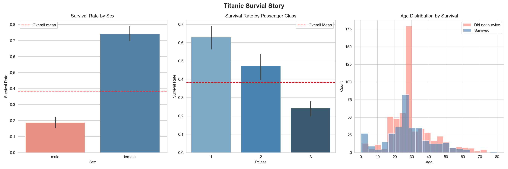
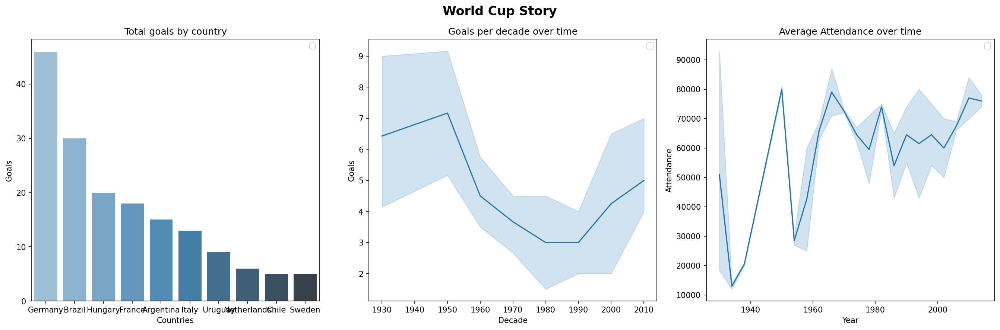

# ML Journey 🤖

A 30-day hands-on machine learning learning log.
Built from scratch — no copy-pasting, every line understood.

**Goal:** Go from Python intermediate to deploying real ML and AI engineering
projects by October 2026.

**Start date:** [your start date]  
**Target:** October 2026 applications

---

## Progress

| Day | Topic | Status |
|-----|-------|--------|
| Day 1 | NumPy — arrays, operations, slicing | ✅ |
| Day 2 | Pandas — DataFrames, filtering, groupby | ✅ |
| Day 3 | Pandas — missing values, merging, apply | ✅ |
| Day 4 | Matplotlib & Seaborn — visualisation | ✅ |
| Day 5 | Full EDA project — World Cup dataset | ✅ |
| Day 6 | Portfolio polish | ✅ |
| Day 7 | Rest | — |
| Day 8 | Scikit-learn — first ML model | 🔜 |
| Day 9 | Classification & evaluation metrics | 🔜 |
| Day 10 | Model evaluation & cross-validation | 🔜 |
| Day 11 | FastAPI — serve ML model as API | 🔜 |
| Day 12 | Docker — containerise the API | 🔜 |
| Day 13 | End-to-end ML project | 🔜 |
| Day 14 | Polish & deploy | 🔜 |

---

## Key Projects

### 📊 Titanic EDA & Feature Engineering (Days 2–4)
Full exploratory analysis of the Titanic dataset — missing value handling,
feature engineering, correlation analysis, and survival story visualisation.

### 🌍 World Cup EDA (Day 5)
Independent EDA on World Cup match data — total goals by country, goals
per decade, attendance trends.

---

## Tech Stack
Python · NumPy · Pandas · Matplotlib · Seaborn · Jupyter
